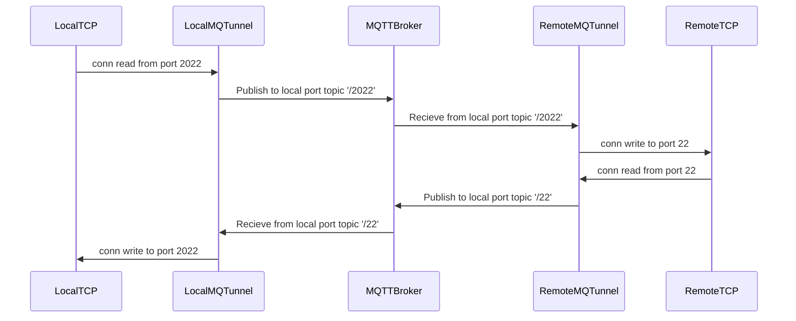

# mqtunnel: tunnel via MQTT broker

This tool tunnels TCP Connection through the MQTT Broker.

In other words, poor-man's [AWS IoT Secure tunnel](https://docs.aws.amazon.com/iot/latest/developerguide/secure-tunneling.html).


# How to use

1. Prepare config file with MQTT broker connection endpoint. The `control` means control topic.

```
{
    "host": "localhost",
    "port": 1883,
    "control": "device/1/control"
}
```
2. Run on remote host `mqtunnel -c config.json`
3. Run on local host `mqtunnel -c config.json -l 2022 -r 22` with same config.json.
    - `-l` means local port
    - `-r` means remote port
4. enjoy!

# config file 

We can use certs in Config file.

```
{
    "host": "A11222333.iot.ap-northeast-1.amazonaws.com",
    "port": 8883,
    "caCert": "certs/root-CA.crt",
    "clientCert": "certs/5a880e296f-certificate.pem.crt",
    "privateKey": "certs/5a880e296f-private.pem.key",
    "control": "device/1/control"
}
```

# Architecture

Example: Local port = 2022, Remote port = 22,



# License

- Apache License


