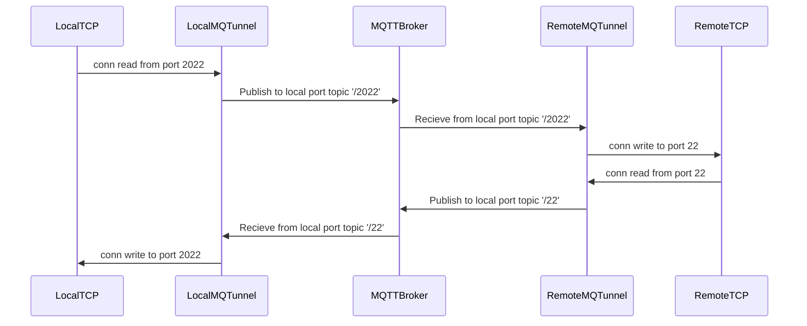
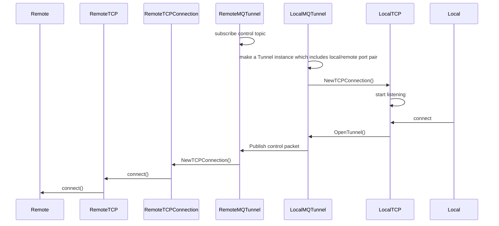

# mqtunnel: tunnel via MQTT broker

This tool tunnels TCP Connection through the MQTT Broker.

In other words, poor-man's [AWS IoT Secure tunnel](https://docs.aws.amazon.com/iot/latest/developerguide/secure-tunneling.html).


Note: This tool is under construction. Please do not use this yet.

# How to use

1. Prepare config file with MQTT broker connection endpoint. `control` means a topic name which is used for sending control packet. The topics used for a tunnel will be created at the same level as this control topic. Therefore, wildcard permission of at least `+` for this level is required.

```
{
    "host": "localhost",
    "port": 1883,
    "control": "device/1/control"
}
```
2. Run on remote host `mqtunnel -c config.json`
3. Run on local host `mqtunnel -c config.json -l 2022 -r 22` with same config.json.
    - `-l` : local port
    - `-r` : remote port
4. Enjoy!

# Config file 

We can use certs in Config file.

```
{
    "host": "A11222333.iot.ap-northeast-1.amazonaws.com",
    "port": 8883,
    "caCert": "certs/root-CA.crt",
    "clientCert": "certs/5a880e326f-certificate.pem.crt",
    "privateKey": "certs/5a880e326f-private.pem.key",
    "control": "device/1/control"
}
```

# Important Notice: Security

This tool itself has no security. If encryption is required, use ssh or similar.

Also, please note that although the topics used add random strings, they can be easily sniffed by others who are authorized to read wildcards.

# Architecture

Example: Local port = 2022, Remote port = 22,



## More internal architecture




# License

- Apache License
